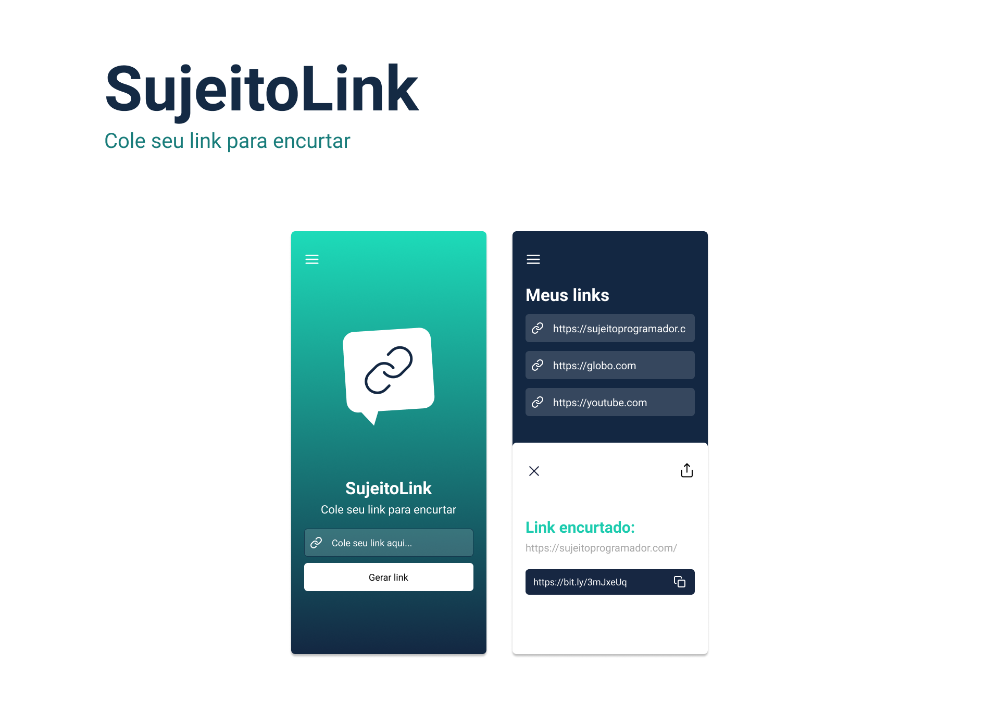

  <a href="#-tecnologias">Tecnologias</a>&nbsp;&nbsp;&nbsp;|&nbsp;&nbsp;&nbsp;
  <a href="#-projeto">Projeto</a>&nbsp;&nbsp;&nbsp;|&nbsp;&nbsp;&nbsp;
  <a href="#-layout">Layout</a>&nbsp;&nbsp;&nbsp;|&nbsp;&nbsp;&nbsp;
  <a href="#memo-licença">Licença</a>

 

  

 

  

## 🚀 Tecnologias

Esse projeto foi desenvolvido com as seguintes tecnologias:

- Node.js
- React Native
- Expo
- Styled Components
- React navigation
- Bitly
- Axios

## 💻 Projeto

O Sujeito link é uma aplicação que tem como objetivo encurtar url e compartilhar de forma fácil.

## 🔖 Layout

No link abaixo você encontra o layout do projeto mobile. Lembrando que você precisa ter uma conta no [Figma](http://figma.com/) para acessá-lo.

- [Layout Mobile](https://www.figma.com/file/7JMmKL0T6qbjYfLFTLL3Vo/Sujeito-programador---Insider-3.0---sujeito-link)

---

Feito com ♥ by Lincoln silva :wave:

[Instagram](https://www.instagram.com/_lincolnsilva_/)
[Github](https://github.com/LincolnSA)
[Portfólio](https://lincolnsa.github.io/portfolio/)
[devlincolnsilva@gmail.com](mailto:devlincolnsilva@gmail.com?subject=Oi%20lincoln)
